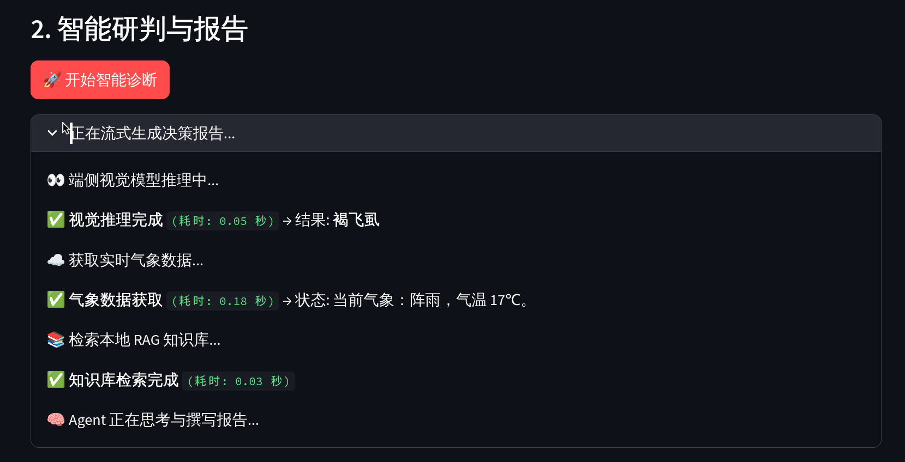
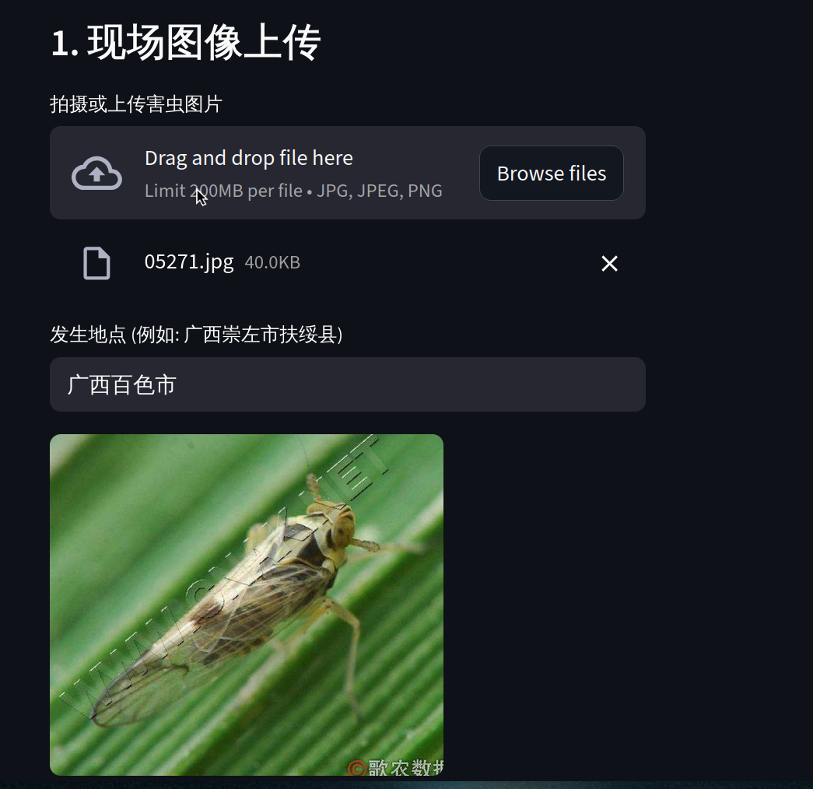
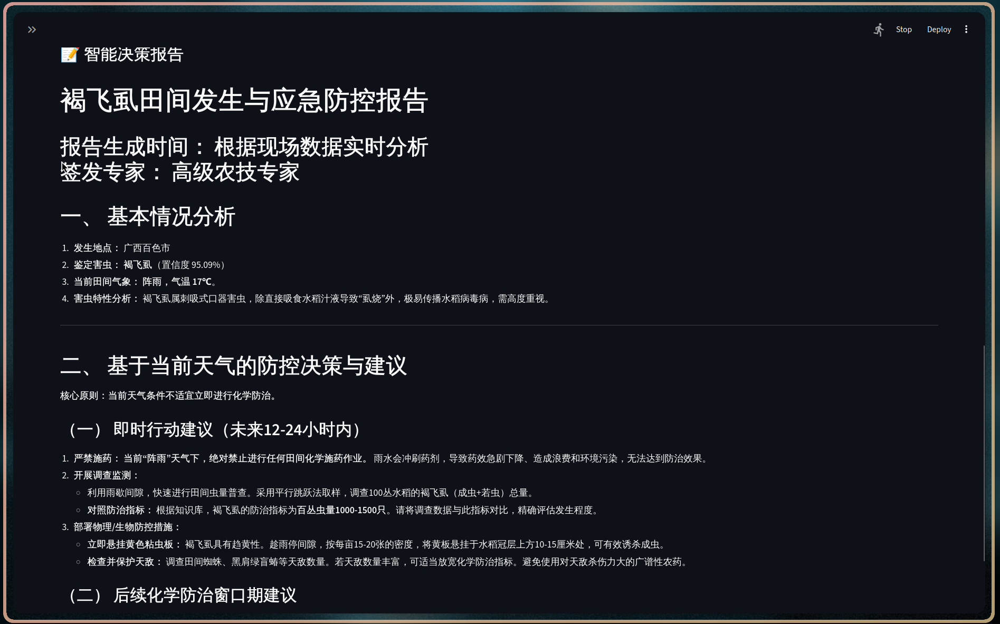
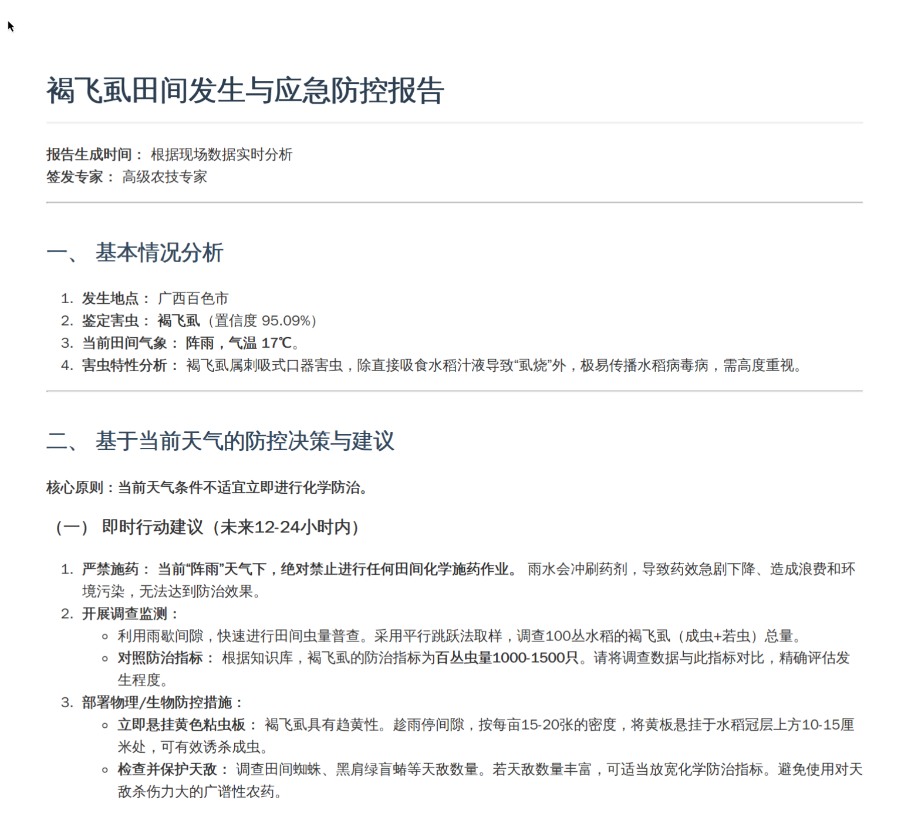

# 🌾 基于“端侧视觉+大模型”的害虫智能监测与治理 Agent


本项目是一种“端云协同、识治一体”的生物安全智能治理 Agent。系统旨在解决传统农业与基层生物治理中存在的“识不准、报不快、治不好”三大痛点，通过人工智能赋能社会治理，构建“单点监测—智能研判—全域预警”的数字治理闭环 。

## 📸 系统截图

<div align="center">
  
  
  
</div>

## ✨ 核心亮点

本项目采用“视觉感知（CNN）+ 认知决策（LLM）”的双塔技术架构 ：

1. 端侧极速精准感知 (CNN)
   - 采用基于 ResNet50 的轻量化视觉模型。
   - 支持 10 种重点水稻害虫（如稻纵卷叶螟、二化螟、褐飞虱等）的毫秒级离线识别。
2. 云端智能决策研判 (LLM Agent)
   - 接入 DeepSeek 等大语言模型，模拟农业专家思维链 。
   - 结合实时气象数据（温度、湿度等）与地理位置进行多模态综合研判。
3. 本地化 RAG 农业知识库
   - 内置基于 `BAAI/bge-small-zh-v1.5` 向量化模型的 Chroma 本地数据库。
   - 支持一键上传解析 PDF/TXT 格式的农技规程、防治手册，实现知识库动态扩容。
4. 一键生成政务级公文
   - 自动生成包含危害等级评估、科学消杀建议（结合天气特征）及行政预警公文的结构化 Markdown 报告。
   - 提供导出下载 PDF 功能，极大降低基层网格员行政成本。

<div align="center">
  
</div>

## 🛠️ 技术栈

- 前端交互: Streamlit
- 深度学习: PyTorch, Torchvision
- 大模型框架: OpenAI API 规范, LangChain
- 向量数据库: Chroma
- 词向量模型: HuggingFace `BAAI/bge-small-zh-v1.5`

## 🚀 快速开始

### 1. 环境准备

#### 方式一：本地源码部署

```bash
# 克隆仓库
git clone [https://github.com/timetetng/pest_agent_system.git](https://github.com/timetetng/pest_agent_system.git)
cd pest_agent_system

# 安装依赖
pip install -r requirements.txt

# 启动应用
streamlit run app.py


```

#### 方式二：Docker 部署（推荐）

```bash
# 克隆仓库
git clone [https://github.com/timetetng/pest_agent_system.git](https://github.com/timetetng/pest_agent_system.git)
cd pest_agent_system

# 构建容器并启动
docker-compose up -d --build


```

### 2. 打开 WebUI 页面

浏览器访问: `http://localhost:8501`

### 3. 系统配置

在侧边栏中或系统环境中`.env`配置以下参数：

* LLM API Key & Base URL (如 DeepSeek 或 OpenAI 密钥)
* 天气 API Key (如心知天气)

## 👥 团队信息

所属学院: 数学与信息科学学院 - LX Lab

项目负责人: 陆盛斌

项目成员: 陆盛斌(数学与信息科学学院应数221班)、谢林宏（数学与信息科学学院信科221班）

指导教师: 陈良 (副教授)

展示页面：[`https://ai.lsgbin.com`](https://ai.lsgbin.com)

